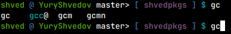
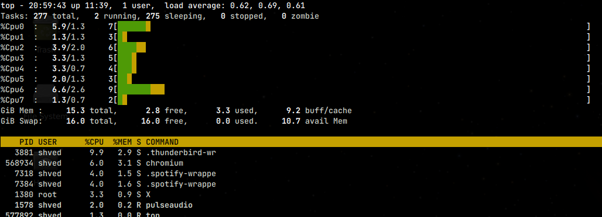

# Yury Shvedov's NixOS configuration

## Structure

* [nixos](./nixos) - The root of configuration. Almost all features are there

* [nda](./nda) or [nda.nix](./nda.nix) - The employer specific configurations
which can not be shared publicly because of NDA.

* [secrets](./secrets) or [secrets.nix](./secrets.nix) - The personal secret
information like keys, passwords, hashes, etc. which never should be
committed.


## Features

### [User](./nixos/user/default.nix)

Configuration is intended for single-user, so it simplifies its configuration
process:

```nix
  config.local = {
    user = {
      login = "<your login>";
      name = "<your full name>";
      home = "<homedir defaults to /home/${login}>"
      domainName = ''
        Your login withing employer domain. Defaults to your surname in ${name}
        and depending on ${hasNamesake} extra _<first letter of ${name}> suffix
      '';
      extraGroups = [ "<extra groups for your login>" ];
      mail = "<your e-mail. Defaults to current employee e-mail>";
    };
  };
```

### [Homedir](./nixos/user/homedir.nix)

Wrapper on `home-manager.users.${login}` configuration.

```nix
  config.local = {
    activations = {
      "<any_activation>" = {
        after = [ ''
          List which is first argument to dag.entyAfter or string of one.
          Defaults to [ "writeBoudary" ];
        '' ];
        script = ''
          The script to execute in home;
        '';
      };
      "<any_other_activation>" = ''
        Same as above, but maximum simplified.
      '';
    };
  };
```

### [Bashrc](./nixos/bashrc)

Configures bashrc and inputrc:

* Pretty PS1 script, integrated with git and network namespace:

    

* History search with Up and Down arrows
* Colored completion
* Use nix-index for `command-not-found.sh`
* Use undistractMe script to notify for finishing long operation
* Some useful aliases like `gtree` and `ll`

### [Desktop](./nixos/desktop/default.nix)

Use xfce for desctom and lightdm for "DE". The xfce configuration does not
work properly.

### [Media](./nixos/media/default.nix)

Enable pulseaudio with some useful modules. Ready-to-use configuration for
pipewire enabled too, but pipewire is not very stable for now.

### [Spotify](./nixos/media/spotify/default.nix)

Two choices here:

1. Spotify as standalone proprietary client.
2. Spotifyd as background open source server.

```nix
  config.services.spotify = {
    daemon = false;
    username = "Your spotify username for daemon";
    password = "Your spotify passford for daemon";
  };
```

The spotifyd appeared to be not usable and buggy. Both ways installs
`playpausespotify` script which toggles playback independent on chosen
approach.

### [Packages](nixos/packages/default.nix)

Installs many useful packages of different types: evince, minicom, teamviwer,
etc., and also:

#### [Vim](nixos/packages/vim)

This is highly-loaded ready-to-use as IDE with many plugins like vim-lsp, ctags,
etc.

#### [Gnupass](nixos/packages/gnupass.nix)

This installs, downloads and deploys your gnupass storage with specified gpg key
and remote repository.

```nix
  config.local.gnupass = {
    enable = true;
    gpgid = "Package with gpg.id file in out path";
    giturl = "Url of git repo for gnupass";
  };
```

Unfortunately this is not working properly for now. You have to install gpg key
by hands:

```bash
    gpg2 --import <your_private_key>
```

#### [3d](nixos/packages/3d/default.nix)

The set of software related to 3D-modelling and 3D-printing.

```nix
  config.local.threed = {
    enable = true; # Whenether to install 3D-related software.
  };
```

#### [Browsers](nixos/packages/browsers/default.nix)

Chooses which browser to use and takes care on joining their nss (global trusted
certificates) together.

```nix
  config.programs = {
    chromium = {
      enable = true;
      useKerberos = false; # Do we need to re-compile chromium with Kerberos
                           # support
    };
    firefox.enable = false;
  };
```

### [Services](nixos/packages/services/default.nix)

Enable services on current machine:

* [transmission](nixos/packages/services/transmission.nix). The torrent daemon
and remote UI client to it. It will download by default to user's home/Downloads
folder. It is needed to download different Linux distribution images.

* [power](nixos/packages/services/power.nix) Configures suspend by Power-Key and
Wakening-Up by Power-Key only.

* [ssh](nixos/packages/services/ssh.nix). Configures local SSH server and client.

* [git](nixos/packages/services/git.nix). Configures git client. Will do nothing
if config.local.user.mail is not set.

* [top](nixos/packages/services/top.nix). Installs toprc configuration for top
utility in view:

    

### [Tools](nixos/tools/default.nix)

* [make](nixos/tools/make.nix). Alias for make, which runs make inside nix shell
with several commonly useful packages. Additionally in case when there is no
Makefile in current folder it searches for Makefile in subfolder for
out-of-source builds.

* [python](nixos/tools/python/default.nix). Installs pyshell script which runs
nix shell with several packages and additionally adds packages from command
line arguments in view like:

    ```
    pyshell pyserial
    ```

* [ide](nixos/tools/ide/default.nix). The launcher for gvim written with pyQt.
Rises dialog with table with previously launched project.

* [dhcps](nixos/tools/dhcps/default.nix). The DHCP Server launcher. Simplifies
usage of dnsmasq.

### [Kaspersky](nixos/kl/default.nix)

Here is part which does not covered by NDA and available freely from public
resources.

#### Configuration

```nix
  config.local.kl = {
    enable = true; # Does this machine used by Kaspersky Lab employee
    mail = ''
      Employee e-mail. By default is <name>.<surname>@kaspersky.com.
    '';
    remote.enable = true; # Does this machine used to gain remote access to
                          # Kaspersky Lab network domain
    domain = {
      enable = true; # Does this machine physically inside Kaspersky Lab network
                     # domain
      host = ''
        The employee's machine hostname inside Kaspersky Lab domain if needed.
      '';
    };
  };
```

#### [Certificates](nixos/kl/certificates/default.nix)

This installs Kaspersky Lab CA certificates into system globally. The
configuration of browser will takes care of gathering this certificates too.

#### [Klvpn](nixos/kl/remote/klvpn/default.nix)

This installs and configures special klvpn script, which uses p11tool, cisco
openconnect, and e-Token module to connect to
[Kaspersky Lab Vpn](https://vpnhelp.kaspersky.com/) server.

Just insert your E-Token into USB port, type `klvpn`, provide your login
password for `sudo` and then your token password and you are in.

## Installation

1. Go through generic installation
[manual](https://nixos.org/manual/nixos/stable/#sec-installation) till 4-th
paragraph of
[2.3 Installing](https://nixos.org/manual/nixos/stable/index.html#sec-installation-installing)
section. Before editing configuration.nix, you need to do next:

2. Add home-manager channel:
     ```bash
     nix-channel --add \
         https://github.com/nix-community/home-manager/archive/release-21.05.tar.gz \
         home-manager
     ```

3. Mount (or copy) this repo near the configuration.nix, e.g.:
     ```bash
     mkdir /mnt/etc/nixos/shvedpkgs
     mount -o bind /mnt/home/<your_login>/shvedpkgs
     ```

4. Edit configuration.nix and `./shvedpkgs` to imports.

5. Optionally you can add local extra configurations like
`local.theed.enable = true`.

6. Follow further the generic installation process.

7. After entering fresh installation you better to add mount point of your
configuration:
    ```nix
    fileSystems."/etc/nixos/shvedpkgs" = {
      device = "/path/to/your/placement/of/this/repo";
      options = [ "bind" ];
    };
    ```
